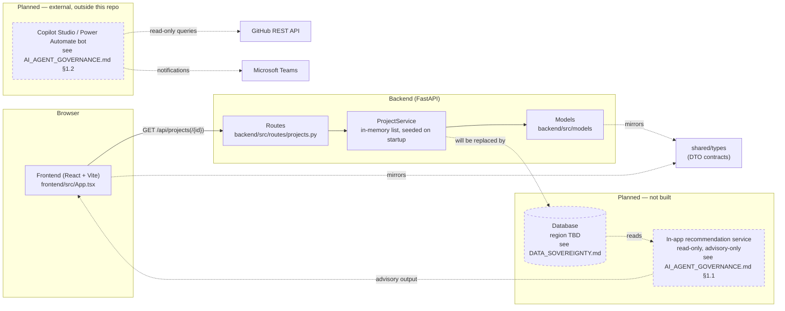

# Architecture

The project is organized as a small monorepo:

- `backend/src/models` owns domain schemas and enums.
- `backend/src/services` owns business operations and data access boundaries.
- `backend/src/routes` exposes HTTP contracts through FastAPI.
- `frontend/src` owns the dashboard experience and API client.
- `shared/types` contains frontend-facing DTO contracts that mirror the API.

The current service uses in-memory seed data to keep the first slice easy to
run. A database repository can replace `ProjectService` without changing the
route contract. AI recommendations should be added as a separate service once
the project and task data contract is stable.

## Diagram

The solid path is what runs today: the frontend calls the FastAPI routes,
which read from the in-memory `ProjectService`, with `shared/types` mirroring
the contract on both sides. The dashed boxes are not implemented — they
correspond exactly to the two agents scoped in
[AI_AGENT_GOVERNANCE.md §1](AI_AGENT_GOVERNANCE.md#1-scope). The future
database node is the data-sovereignty decision point: its region and
compliance posture must be decided using the template in
[DATA_SOVEREIGNTY.md](DATA_SOVEREIGNTY.md) before it's built, not after.